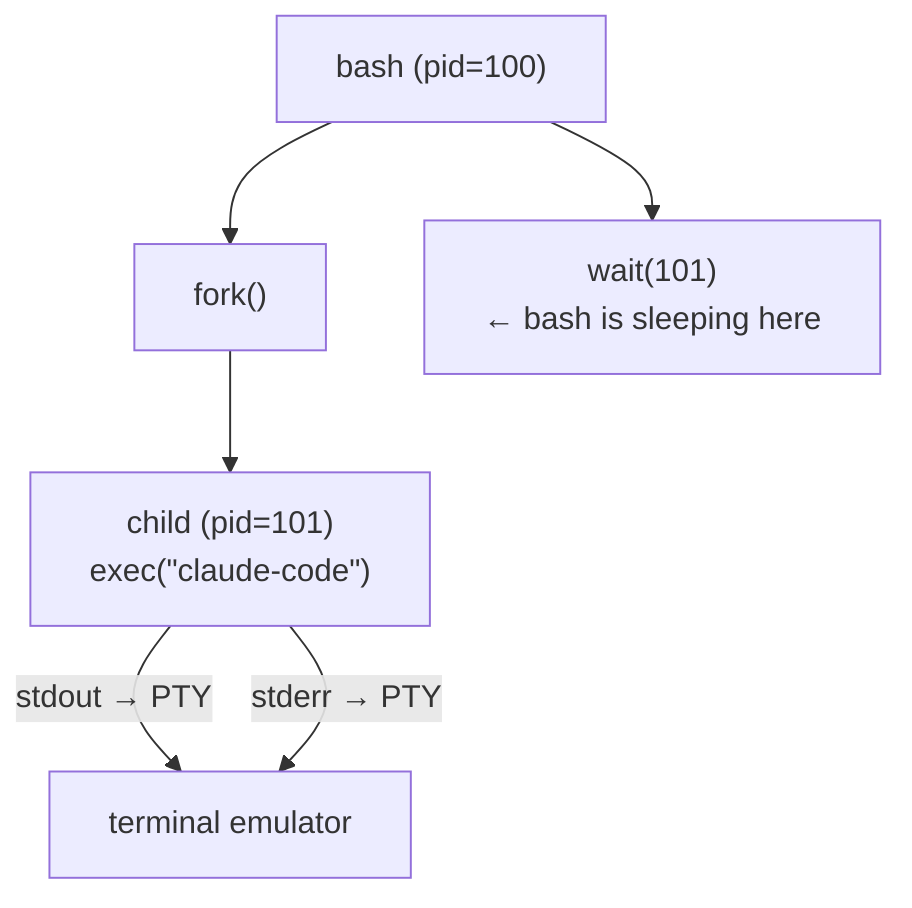

# ptylenz — Design Rationale

> English · [日本語](DESIGN.ja.md)

> This document records the thinking that produced ptylenz, distilled
> from a design conversation on 2026-04-12.

## Starting point: "I want to write a shell"

The initial motivation was "I want to write my own shell." Going from "I use bash without any opinions" to seeing colleagues' elaborate setups (zsh + Oh My Zsh + Powerlevel10k) produced the urge to build my own tool.

## What's actually inside a shell

A shell is fundamentally a REPL, and its interface to the OS is shockingly small:

- `fork()` — duplicate a process
- `exec()` — replace the child's image
- `wait()` — wait for the child to finish
- `pipe()` — connect file descriptors

Four syscalls and the execution engine of a shell is done. What differentiates one shell from another lives entirely in the **UI layer** sitting on top of that OS interface.

## What I learned comparing bash / zsh / fish / nushell

| Axis | Where they compete |
|------|--------------------|
| Line editing | readline vs. ZLE vs. own implementation |
| Completion | callback-style vs. declarative vs. type-driven |
| Script language | string-based vs. structured data |
| Prompt | hand-written escape sequences vs. framework |

The most innovative shells, briefly:

- **Warp** — reinvents the terminal emulator in Rust; output is managed as blocks.
- **Nushell** — pipelines carry structured data (tables) instead of strings.
- **Oils / YSH** — POSIX-compatible with an upgrade path from bash.
- **fish** — best-in-class interactive experience out of the box.

## The UBNF-shell idea, abandoned

I considered a shell built on [unlaxer](https://github.com/opaopa6969/unlaxer) (a UBNF parser-combinator):

- declare shell grammar in UBNF
- generate completion / highlighting / debugger from the same grammar
- let users extend the grammar in `.ubnf` files

Technically interesting, but a classic "the mummy hunter becomes a mummy" trap. With many other things to build, reinventing a full shell is not the right place to spend time.

## Finding the real pain

It wasn't "I want a shell." The real problem was that the **terminal experience is bad**.

Concretely, using Claude Code / Codex inside tmux is brutal:

- The AI prints thousands of lines and the top scrolls off
- tmux's selection mode is painful for copying
- Searching for "that thing earlier" via scrollback is a VT100-era experience
- Workarounds (write to files, ask Claude to render an HTML report) just to escape the terminal

> "It's 2026 and you're eyeball-grepping a scrollback buffer — what decade is this?"

## "What is the shell doing after the process starts?"

This is the central insight:



**bash is not in the data path.** claude-code's output goes through the PTY (kernel layer) directly to the terminal. bash is just blocked in `wait()`, watching nothing.

So **structuring the output at the shell layer is the wrong layer.**

## Where can we intervene?

There are four places to put a hand on the output stream:

| Approach | Description | Example |
|----------|-------------|---------|
| A. Terminal emulator | reinvent the renderer | Warp |
| B. PTY proxy | sit on the master side and relay everything | tmux |
| C. Shell integration | emit OSC markers at boundaries | iTerm2, VS Code Terminal |
| D. Modify the producer | change the source program | not in our control |

**Conclusion: B + C.** Use a PTY proxy (B) to see every byte, and shell integration (C) to detect block boundaries precisely.

## The parallel with syslenz

```
syslenz: /proc (kernel-provided text)  → structure → TUI
ptylenz: PTY   (kernel-provided text)  → structure → TUI
```

Same pattern. Same motivation ("`cat /proc` is 70s UX" ≈ "scrollback grep is also 70s UX"). Same tech base (Rust + ratatui).

## Design principles

1. **Zero config, 80% by default** — single binary, no setup
2. **Don't break bash** — wrap it on the inside, never replace it
3. **Block-shaped output solves everything** — scroll, copy, search all dissolve at once
4. **Surface space only when asked** — no permanent panel; UI appears in context
5. **Future extensions plug in** — UBNF completion, syslenz integration, DAP can all attach later

## Where the name comes from

- syslenz = system + lens (a lens onto your system)
- ptylenz = PTY + lens (a lens onto your PTY stream)

Two siblings in a `lenz` family with the same design philosophy.

## Future expansion (not now)

- UBNF-based shell input completion (LSP, separate process)
- Shell-script TUI debugger (DAP, separate process)
- Embedded syslenz panel (one of ptylenz's panels)
- Structured pipelines (nushell-style)
- Semantic analysis of AI output (diff detection, file-change summaries)
- Session persistence (replace tmux for that purpose)

## Appendix: optional dependencies (feature gates)

Playbook for opting into heavy or quality-only dependencies. C solves this with `#ifdef`; Rust uses **Cargo features + `#[cfg(...)]`** — same idea, declared in `Cargo.toml` instead of passed as compiler flags.

### Minimal example

`Cargo.toml`:

```toml
[features]
default = []
grapheme-truncate = ["dep:unicode-segmentation"]

[dependencies]
unicode-segmentation = { version = "1", optional = true }
```

- `optional = true` — crate is only linked when the feature is on.
- `dep:unicode-segmentation` — "enabling this feature pulls in the same-named crate" (Rust 1.60+ syntax).

Code side:

```rust
#[cfg(feature = "grapheme-truncate")]
use unicode_segmentation::UnicodeSegmentation;

fn truncate(s: &str, max: usize) -> String {
    #[cfg(feature = "grapheme-truncate")]
    { /* grapheme-aware truncation */ }
    #[cfg(not(feature = "grapheme-truncate"))]
    { /* codepoint-boundary fallback */ }
}
```

Build:

```bash
cargo build                                    # defaults only
cargo build --features grapheme-truncate       # enable feature
cargo build --no-default-features              # turn off default features too
```

### Mapping to C

| C | Rust |
|---|------|
| `#ifdef FOO` | `#[cfg(feature = "foo")]` |
| `-DFOO` | `--features foo` |
| `#ifndef FOO` | `#[cfg(not(feature = "foo"))]` |
| conditional `#include` | `optional = true` in `Cargo.toml` |

`#[cfg(...)]` isn't limited to features:

```rust
#[cfg(target_os = "linux")]
#[cfg(target_arch = "x86_64")]
#[cfg(debug_assertions)]    // debug builds only
#[cfg(test)]                // cargo test only
#[cfg(all(unix, not(target_os = "macos")))]
```

Attaches to functions, modules, struct fields, use statements — fine-grained.

### When to feature-gate in ptylenz

- **Gate it**: heavy dependencies / dependencies with alternatives (e.g. clipboard backends) / platform-specific impls.
- **Don't gate**: small, always-useful deps — default-on with no branching is easier to maintain.
- Feature combinations blow up the test matrix, so **keep the number small**.

Current candidates: none. `unicode-segmentation` (ZWJ / grapheme cluster support) was added unconditionally as a default dependency — small enough that a feature gate would be overkill.
