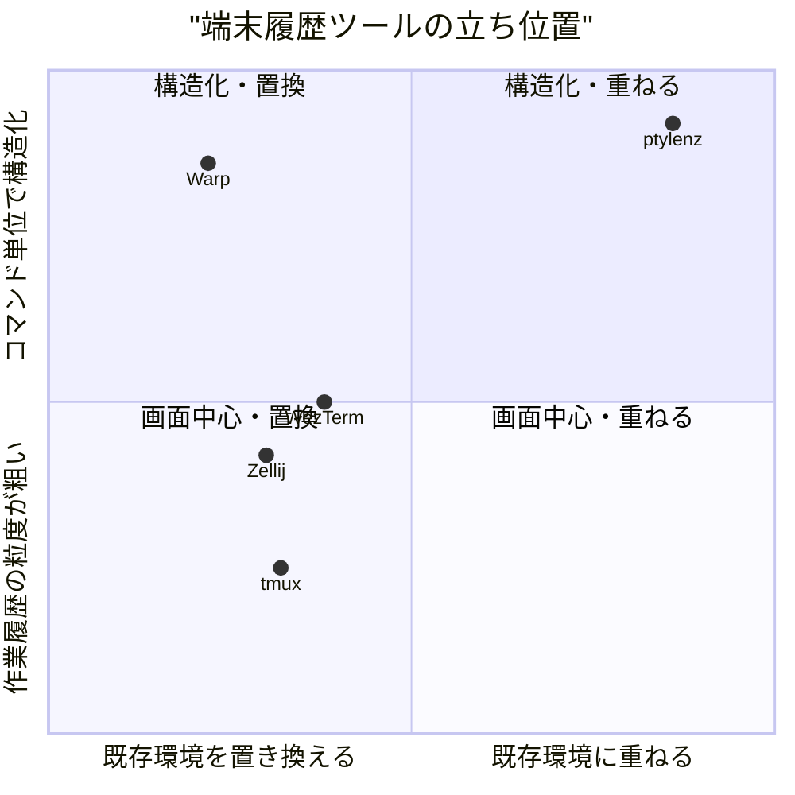
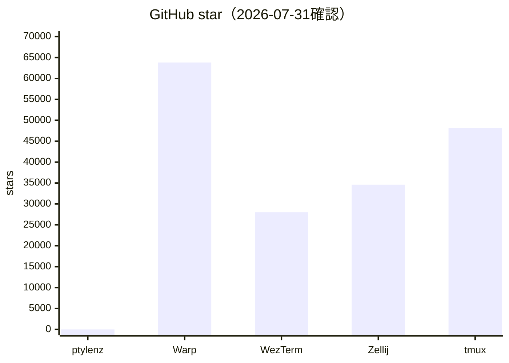
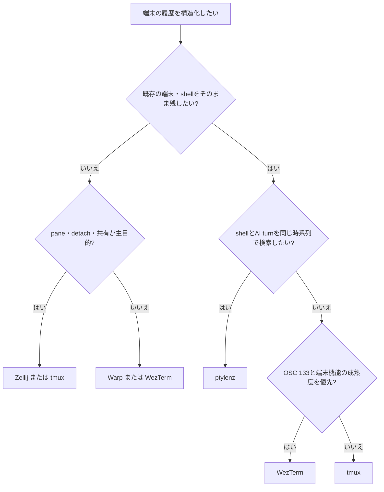

# 0. 要約

立ち位置: ptylenzは既存の端末・シェルを置き換えず、PTYの生バイト列からコマンド単位の履歴を作る透過型CLIである。

最大の弱点: 現状はbash中心・Linux/macOS限定で、テストが45件中3件失敗しており、成熟した端末/マルチプレクサとの差が大きい。

次の一手: 互換性を広げる前に、OSC 133を使った「壊さずにブロック化する」経路を安定化し、Claude Codeとの時系列統合を再現可能なセッション形式として固める。

# 1. このrepoは何か

ptylenzは、ユーザー端末とbashの間に入る単一バイナリのPTYプロキシである。通常モードでは入力・出力をほぼそのまま中継し、OSC 133（A/C/D/E）を解析して「1コマンド＋出力」をBlockに分ける。`Ctrl+]`でratatuiのオーバーレイに入り、ブロック一覧、折りたたみ、全文検索、コピー、ピン留め、JSON出力、詳細画面での行/矩形選択を行う。[README](https://github.com/opaopa6969/ptylenz/blob/29bb70837134dc79b5b08b0326de88c12ea0ef08/README.md) と [architecture.md](../architecture.md) の説明だけでなく、`src/pty.rs`・`src/block.rs`・`src/tui_app.rs`・`src/claude_feeder.rs`を読んで確認した。

価値の単位はptylenz単体の解析ライブラリではなく、**既存シェル + ptylenz + オーバーレイUI + （任意で）Claude Code JSONL**の利用体験全体である。したがって比較対象はPTY/VT100ライブラリではなく、端末出力の検索・コピー・セッション管理を含む端末ツールにした。

主な利用者は、長いCLI出力を後から探したい開発者、端末上でClaude Codeとシェル操作を往復する開発者、SSH先でも既存のシェル環境を変えたくない利用者である。到達点として、自repoの確認値はRustソース3,694行、Cargo直接依存12、`pub`項目46、テスト45件。`cargo test`は42件成功、3件失敗（PTY統合テスト）だった（2026-07-31実行）。公開リリースはREADME記載のv0.1.0である。

# 1.5 調査の型

`hybrid`とした。厳密にはホスティングサービスではなくローカルOSS CLIだが、OSSバイナリがPTY・TUIを提供し、外部プロセスであるClaude CodeのJSONLを任意に取り込む構成なので、libraryとしてAPIだけを比較するより利用者向けツール全体として比較する方が実態に合う。コードを読めるため、実装比較は自repoと公開ソースの構成・manifestまで確認した。ただし競合はアプリケーションであり、安定した公開API数を持たないため、その列を無理に数値化していない。

# 2. 比較対象と選定理由

| 製品 | 何ができるか | 採用状況（2026-07-31確認） | ライセンス | うちとの決定的な違い | なぜ比較対象に選んだか |
|---|---|---|---|---|---|
| [Warp](https://github.com/warpdotdev/Warp) | ブロック型端末、AIエージェント、Claude Code等との統合 | ★63.8k / GitHub上の最新コミット日付は取得できず。リポジトリは1,866コミット | AGPL-3.0（UIフレームワーク等はMIT） | 端末UIとエージェント体験を製品として一体提供。ptylenzは既存端末を残す | ブロックUIとAI統合の最も直接的な製品比較 |
| [WezTerm](https://github.com/wezterm/wezterm) | GPU端末、マルチプレクサ、検索可能スクロールバック、OSC 133 | ★28.0k / 最新コミット 2026-03-31、最新リリース 2024-02-03 | MIT | 画面グリッド中心の汎用端末。ptylenzはPTY生バイトとコマンドBlockを中心にする | OSC 133とスクロールバック検索の実装・UXが近いOSS |
| [Zellij](https://github.com/zellij-org/zellij) | ペイン、セッション、共有、Webクライアント、スクロールバックの検索・購読 | ★34.6k / 最新リリース v0.44.3 2026-05-13 | MIT | セッション/ペインの共有・復旧が主目的。ptylenzは単一シェルの履歴理解が主目的 | tmuxの代替として普及し、ptylenzの将来計画「session persistence」と重なる |
| [tmux](https://github.com/tmux/tmux) | セッションのdetach/attach、複数端末、スクロールバック | ★48.2k / 最新リリース 3.6b 2026-05-20 | ISC | 画面セルとセッション維持が中心で、コマンドBlockやClaude turnは持たない | 現在の代替手段として最も一般的で、README自身が比較対象にしている |

この地図は「端末」市場全体ではなく、端末の中で後から過去の作業を扱う層の地図である。Warpはブロックを製品の中心に置き、WezTerm/Zellij/tmuxは成熟した端末・ワークスペースとして横幅を持つ。したがって、ptylenzが画面描画やセッション共有で正面衝突すると、stars・対応OS・運用実績で不利になる。一方、既存シェルを温存しながらコマンドとAI turnを同じ時系列にする軸は、4製品の主機能表からは埋まっていない。

# 3. ポジショニング

軸の意味: 横軸は既存シェル/端末との置換度、縦軸はユーザーが戻れる履歴の構造化粒度。Warpのブロック中心設計と、WezTermのOSC 133対応・検索機能は公式資料で確認できるため、図は機能上の位置づけとして描いた。距離の厳密な測定値ではない。

# 4. 機能比較

| 機能 | 重み | ptylenz | Warp | WezTerm | Zellij | tmux |
|---|---|---|---|---|---|---|
| 既存シェルを透過的に使う | ◎必須 | ○ | △ | △ | △ | ○ |
| コマンド単位のBlock境界 | ◎必須 | ○（OSC 133） | ○ | △（OSC 133のゾーン） | △（ペイン/スクロールバック） | × |
| Block単位の折りたたみ・一覧 | ◎必須 | ○ | ○ | × | × | × |
| 全ブロック横断検索 | ◎必須 | ○ | ○ | △（現タブのscrollback） | △（pane単位） | △（pane単位） |
| 折り返し前の生出力をコピー | ◎必須 | ○ | △ | △ | △ | × |
| exit code・時刻の保持 | ○効く | ○ | ○ | △ | △ | △ |
| TUI/alternate screenの表示復元 | ○効く | ○（vt100 shadow） | ○ | ○ | ○ | △ |
| Claude Code turnとの時系列統合 | ◎必須（固有価値） | ○ | △（AI統合はあるが同じJSONL方式ではない） | × | × | × |
| JSON/共通ログへのexport | ○効く | ○ | △ | × | △（CLI/プラグインAPI） | △（capture-pane等） |
| detach/attach・複数pane | △あれば | × | ○ | ○ | ○ | ○ |
| Windows | △あれば | ×（非対応） | ○ | ○ | ○ | ○ |
| 設定・拡張エコシステム | △あれば | ×（zero config） | ○ | ○（Lua） | ○（KDL/プラグイン） | ○（設定/スクリプト） |

×のうち痛いのは、ptylenzの利用開始を止めるPTY統合テストの不安定さ、bash以外のシェルでBlock境界が弱いこと、Windows非対応である。逆にpaneやdetach/attachの×は、現時点の勝負所ではない。○の中でも検索・コピー・TUI表示は成熟した端末が部分的に持っており、差別化の中心ではなく、BlockとClaude turnを同じ時系列で扱うことが差になる。

# 4.5 コード・実装の比較

| 観点 | ptylenz | Warp | WezTerm | Zellij | 出典 |
|---|---:|---|---|---|---|
| 公開API数 | 46 `pub`項目（自repoをrgで数えた値） | 非該当（アプリ。workspace `crates/*` + `app`） | 非該当（アプリ。多数のworkspace crate） | 非該当（アプリ。server/client/utilsと多数のplugin） | 各リポジトリのmanifest/ソース構成 |
| 直接依存 | 12（Cargo.toml） | workspace依存を集約、数は自repoと粒度が違う | workspace依存を集約、数は自repoと粒度が違う | workspace依存を集約、数は自repoと粒度が違う | [ptylenz Cargo.toml](https://github.com/opaopa6969/ptylenz/blob/29bb70837134dc79b5b08b0326de88c12ea0ef08/Cargo.toml)、[Warp Cargo.toml](https://raw.githubusercontent.com/warpdotdev/Warp/master/Cargo.toml)、[WezTerm Cargo.toml](https://raw.githubusercontent.com/wezterm/wezterm/main/Cargo.toml)、[Zellij Cargo.toml](https://raw.githubusercontent.com/zellij-org/zellij/main/Cargo.toml) |
| Rustソース行数 | 3,694（src/*.rs） | 自repo方式では未計測 | 自repo方式では未計測 | 自repo方式では未計測 | 2026-07-31にローカルcheckoutしていないため推測で埋めない |
| テスト | 45件定義、42成功/3失敗（`cargo test`実行） | presubmit/test手順あり。実行していない | ローカルテスト実行なし | ローカルテスト実行なし | 各プロジェクトの公開手順と自repo実行結果 |
| 構成規模の客観指標 | 5 Rust source files / 1 binary | 1,866 commits、`crates/*` + `app` | 8,631 commits、20前後のworkspace member | 3,269 commits、多数のserver/client/plugin member | GitHub repository pages（2026-07-31確認） |

ptylenzは小さく読める一方、PTY・VT100・シェル統合・TUIを一つのバイナリで抱えるため、機能を増やすほど「単純なCLI」の利点が早く失われる。競合のworkspace規模は直接の優劣ではないが、端末互換性・OS対応・テスト資産に投資できる構造の差を示す。公開API数を競合と比較できないのは、比較対象がライブラリではなく完成品だからであり、ここで数字を推測しないこと自体が比較の前提を守る。

# 5. 採用状況

starsは品質や採用数そのものではないが、ptylenzが成熟製品と同じ一般端末市場で勝負するには認知・互換性の差が大きいことを示す。特にtmux/Zellijは運用目的、Warpはブロック＋AI目的で既に強い。ptylenzはstarsを追うより、「入れ替えずに後付けできる」ことを実際の導入成功率で証明する方が合理的だと思う。

# 5.5 調査者の見立て

本当の勝負所は、ブロックを表示することではなく、既存のbash・色・TUI・SSHを壊さずに、後から検索できる意味単位を取り出すことだと読む。Warpのような製品UIを再現するより、ptylenzの透明な挿入位置と生バイト保持を守る方が差別化になる。

数字に出ていない懸念は、OSC 133を出さないシェルやコマンドで境界が曖昧になること、Claude Code JSONLの内部形式に結合していること、そして現在の3件のPTYテスト失敗である。ドキュメントは厚いが、公開リリース後の継続運用実績はまだ分からない。

自分なら、次は「Block engineの入力契約」と「Claude turnの共通ログ形式」を先に安定化し、bash以外の対応はその契約の上に追加する。セッション永続化は、競合が強い領域なので、差別化された履歴モデルが固まるまで着手しない。

この見立てが外れる条件は、Warpが既存端末へ同じ透過方式で導入できるようになること、またはZellij/WezTermがClaude Codeのturnとshell blockを同一の検索可能モデルで提供することである。その場合、透過性だけでは選ばれる理由にならず、JSON exportの互換性やエージェント横断性が不足する。

# 6. 提案（優先順）

| 順 | 提案 | 分類 | 根拠 | 最小の一手 | 効きそうな指標 |
|---:|---|---|---|---|---|
| 1 | PTY統合テスト3件を再現可能にし、bash/OSC 133の境界をCIで固定する | 埋める | 45件中3件失敗。ここが壊れると中核価値が成立しない | テストの待機条件・PTYサイズ・shell終了処理をログ付きで分離し、Linux CIで安定化 | `cargo test`成功率、境界誤検出数 |
| 2 | Blockの共通ログスキーマとexportを安定版として文書化する | 伸ばす | Claude turnとshell blockの混在、既存のclaude-session-replay exportが固有差別化 | schema version、source、timestamp、exit_code、raw/renderedの契約をdocsに固定 | 他ツールからの再生/取込数、schema破壊的変更数 |
| 3 | zsh/fish等で「境界を取れない場合」の明示的な状態と導入手順を追加する | 埋める | READMEはbash統合を中心に記載。対応シェルの不確実性は導入障壁 | shellごとに検出/非対応を表示し、手動OSC 133フックを最小例で提供 | shell別のBlock生成率、導入失敗報告 |
| 4 | 既存端末を置き換えない導入導線を磨く（単一バイナリ、SSH、復旧） | 伸ばす | Warp/Zellij/tmuxと同じ機能競争を避ける直接的な差別化 | `--shell`等の最小CLI引数、`bash --norc`復旧、互換性チェックを追加 | 初回起動成功率、既存TUIの回帰件数 |
| 5 | detach/attach、Webクライアント、フル端末エミュレータを作らない | やらない | Zellij/tmux/WezTermが既に強く、ptylenzの透明な履歴モデルを薄める車輪の再発明 | roadmapから競合機能を優先対象にしない理由を明記 | 実装面積の増加を抑え、Block/Claude機能への変更比率を維持 |

提案の順番は、機能不足を広く埋める順ではなく、現在の差別化が壊れるリスクを先に下げる順である。特に2は将来の比較可能性を作る投資で、Claude Code以外のエージェント連携にも効く。5を明確にやらないことで、端末製品の総合点競争に流れないようにする。

# 7. 選択の分岐

自分を選ばない条件は、Windows対応、長期セッションのdetach/attach、複数pane共有、GUI端末の描画品質が最優先のときである。反対に、現在のシェル環境を壊さず、長い出力をコマンド単位で振り返り、Claude Codeとの作業履歴を一つにしたい場合にptylenzが向く。

# 8. 出典

| URL | 参照日 | 何の根拠に使ったか |
|---|---|---|
| [ptylenz README](https://github.com/opaopa6969/ptylenz/blob/29bb70837134dc79b5b08b0326de88c12ea0ef08/README.md) | 2026-07-31 | 目的、導入、対応OS、機能、tmuxとの違い |
| [ptylenz architecture](https://github.com/opaopa6969/ptylenz/blob/29bb70837134dc79b5b08b0326de88c12ea0ef08/docs/architecture.md) | 2026-07-31 | PTY proxy、OSC 133、Block engine、Claude feederの実装確認 |
| [ptylenz source tree](https://github.com/opaopa6969/ptylenz/tree/29bb70837134dc79b5b08b0326de88c12ea0ef08/src) | 2026-07-31 | ソース行数、公開項目、テストの確認 |
| [ptylenz Cargo.toml](https://github.com/opaopa6969/ptylenz/blob/29bb70837134dc79b5b08b0326de88c12ea0ef08/Cargo.toml) | 2026-07-31 | 直接依存12、Rust 2021、MIT |
| [Warp repository](https://github.com/warpdotdev/Warp) | 2026-07-31 | ★63.8k、AGPL-3.0/MIT、1,866 commits、AI端末の説明 |
| [Warp Cargo.toml](https://raw.githubusercontent.com/warpdotdev/Warp/master/Cargo.toml) | 2026-07-31 | `crates/*` + `app`のworkspace構成、依存の設計方針 |
| [Warp blocks documentation](https://docs.warp.dev/features/blocks) | 2026-07-31 | ブロック型端末の機能比較 |
| [WezTerm repository](https://github.com/wezterm/wezterm) | 2026-07-31 | ★28.0k、MIT、8,631 commits、workspace構成、最新コミット日 |
| [WezTerm scrollback](https://wezterm.org/scrollback.html) | 2026-07-31 | スクロールバック検索の実際の機能 |
| [WezTerm shell integration](https://wezterm.org/shell-integration.html) | 2026-07-31 | OSC 133とコマンド境界の利用 |
| [WezTerm Cargo.toml](https://raw.githubusercontent.com/wezterm/wezterm/main/Cargo.toml) | 2026-07-31 | workspaceと依存規模のコード確認 |
| [Zellij repository](https://github.com/zellij-org/zellij) | 2026-07-31 | ★34.6k、MIT、3,269 commits、workspace構成 |
| [Zellij releases](https://github.com/zellij-org/zellij/releases) | 2026-07-31 | v0.44.3 / 2026-05-13、採用状況の鮮度 |
| [Zellij Cargo.toml](https://raw.githubusercontent.com/zellij-org/zellij/main/Cargo.toml) | 2026-07-31 | client/server/plugin workspaceと依存のコード確認 |
| [tmux repository](https://github.com/tmux/tmux) | 2026-07-31 | ★48.2k、ISC、tmuxの目的・対応OS |
| [tmux README](https://raw.githubusercontent.com/tmux/tmux/master/README) | 2026-07-31 | detach/attach、依存、ビルド、ライセンスのコード確認 |
| [tmux releases](https://github.com/tmux/tmux/releases) | 2026-07-31 | 3.6b / 2026-05-20 |

stars・最終更新/リリース日は各GitHubページを2026-07-31に確認した値であり、時間経過で変わる。Warpの最新コミット日付は確認時のGitHub表示で取得できなかったため「取得できず」と記載した。競合コードは公開manifest・リポジトリ構成・README/公式ドキュメントを読み、ローカル実行はしていない。自repoについてはローカルコードを読み、`cargo test`を実行したため、実装とテストの記述は高い証拠強度を持つ。
