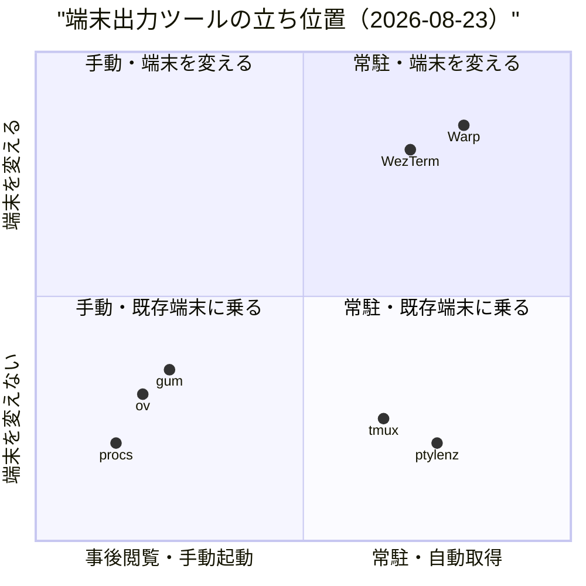
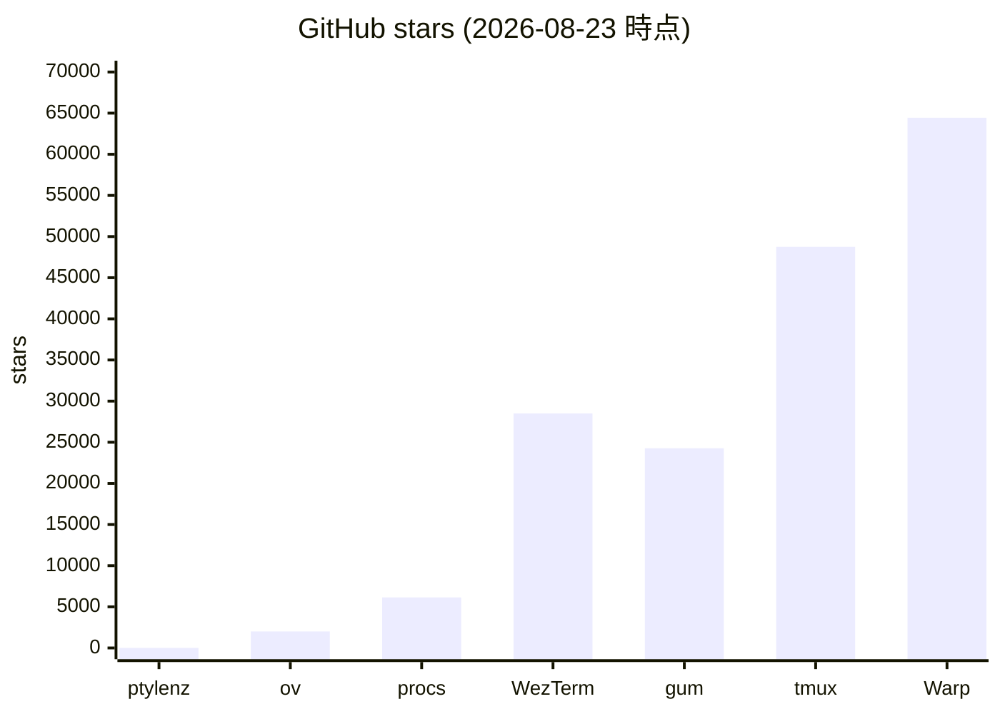
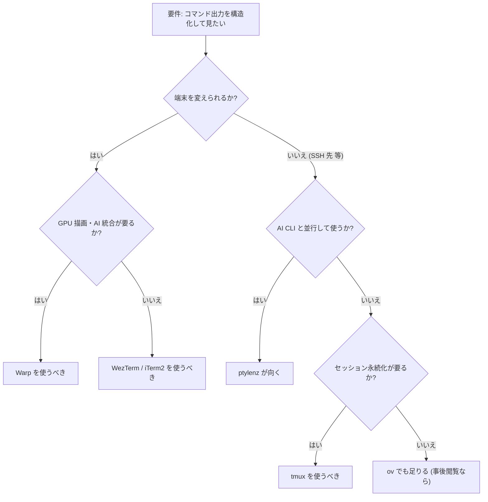

# 0. 要約

- **立ち位置**: bash を PTY の内側で動かし、OSC 133 マーカーでコマンド出力を「ブロック」として構造化する単一バイナリ CLI。tmux より軽く、Warp より裸のシェルに近い。
- **最大の弱点**: 画面を奪う GUI 端末（Warp / WezTerm）と違い、ptylenz はスクロールバックという**画面の問題**を PTY バイト列で解き直している。しかし利用者は「端末を変える」ことなく「出力だけ構造化」できる点が唯一の差別化で、これが薄れると存在意義が消える。
- **次の一手**: Claude Code JSONL 統合（既に実装済み）を他の AI CLI（codex/cursor 等）に拡張し、「AI ペアリング時に出力が追える唯一の軽量ツール」を**勝負所として明示する**。汎用端末機能の拡張はしない。

# 1. このrepoは何か

（README と実コードを照合して書く。README は「Wireshark for your PTY」を謳うが、実コードはもっと狭く「bash を PTY proxy で包み、OSC 133 でブロック化する」のみ）

- **一言**: bash を PTY slave で動かし、OSC 133 マーカーでコマンド出力をブロック単位に切り出して検索・コピー・折り畳み・JSON エクスポートする**単一バイナリ CLI**。TUI オーバーレイは `Ctrl+]` で入り、それ以外は完全に bash に透過。
- **提供価値**: 「長い出力がスクロールで消える」「折り返しでコピーラインが壊れる」「過去の出力を grep できない」という 3 つの PTY 由来の不便を、**端末エミュレータを変えずに**解決する。OSC 133（iTerm2 / Warp / VS Code Terminal と同じプロトコル）でコマンド境界を検出し、生バイト列を保持するため折り返し汚染が起きない。
- **想定利用者**: Claude Code 等 AI CLI と並行してシェルを叩く開発者。SSH 先のサーバなど、Warp / WezTerm のような GPU 端末を入れられない環境で、なおかつ「出力を構造化して見たい」人。
- **到達点の客観指標**:
  - ソース LOC: 3,694 行（`src/*.rs` 5 ファイル、2026-08-23 現在）
  - テスト数: 45（`#\[test\]` 属性。内訳: block.rs 34 / claude_feeder.rs 5 / pty.rs 3 / tui_app.rs 3）
  - 公開 API（pub items）: 46
  - バイナリサイズ: 1,726,056 bytes (1.6 MB, `target/release/ptylenz`, 2026-04-13 ビルド)
  - 公開 URL: なし（ローカル CLI。リリースバイナリのみ GitHub Releases に配置）
  - 稼働状況: v0.1.0 リリース済み（2026-04-13）。最終コミット 2026-08-06。GitHub stars: 0。open issues: 12。
  - 依存クレート: 14（`ratatui`, `crossterm`, `nix`, `vt100`, `polling`, `serde`, `chrono`, `regex`, `unicode-width`, `unicode-segmentation`, `anyhow`, `libc`, `tempfile`, `serde_json`）

# 1.5 調査の型

`target_type: library` — コードが読めるため、機能表だけでなく実装の重さと API 設計を比較できる。証拠は強い。

ただし、ptylenz は**ライブラリクレートではなくバイナリクレート**（`Cargo.toml` に `[[bin]]` のみ、`[lib]` セクションなし）である。他の Rust プロジェクトから `use ptylenz::` で import することは想定されていない。公開 API（`pub fn` / `pub struct`）はバイナリ内部のモジュール間境界であって、外部消費者向けではない。したがって「公開 API 数」を library の比較軸として使うときは、**ptylenz の 46 は内の都合であり、他のライブラリクレートの公開 API 数とは次元が違う**ことに注意する。

この制約により、4.5 節では「公開 API 数」ではなく「バイナリサイズ・依存数・テスト量・配布形態」を主軸に比較する。ptylenz の強み（ゼロ依存に近い単一バイナリ）はここで数字になる。

# 2. 比較対象と選定理由

| 製品 | 何ができるか | 採用状況 | ライセンス | うちとの決定的な違い | なぜ選んだか |
|---|---|---|---|---|---|
| **tmux** | PTY マルチプレクサ。ペイン分割・セッション永続化・`capture-pane` で画面グリッドからコピー | ★48,753 / 最終リリース 3.7c (2026-08-17) | ISC | 同じ PTY master 層にいるが、目的が「ペイン・セッション」で「出力の構造化」ではない。コピーは画面グリッド由来のため折り返し `\n` が入る | 同層で最大の存在。ptylenz が「tmux がやらないことをやる」という立ち位置を明示するために必須 |
| **Warp** | GPU 描写のモダン端末。コマンド出力をブロック化、AI 統合、同期設定 | ★64,441 / 最終 push 2026-08-22 | AGPL-3.0 | 同じ「ブロック化」思想だが GUI 端末そのもの。ptylenz は端末を変えない。Warp は Linux で無料化済み（2026-07 リリースで確認） | 「ブロックベース出力」の思想的祖。ptylenz の差別化が「Warp を入れられない環境で同じ思想を TUI で」であることを示すため |
| **ov** | `less` の後継 pager。列モード・follow・watch・マルチカラー強調 | ★2,006 / v0.54.0 (2026-07-12) | MIT | 出力を**ファイル/パイプから**構造化する。ptylenz は**走りながら**構造化する。ov は事後閲覧、ptylenz は並行閲覧 | 同じ「ターミナル出力を構造化して見る」領域で、入力元が違う（pipe vs PTY）。相補的にも競合的にもなりうる |
| **procs** | `ps` の Rust 版。色付き・ツリー表示・watch モード | ★6,142 / v0.14.12 (2026-06-25) | MIT | `/proc` を構造化するが、PTY には触れない。出力先は stdout のみで、他の PTY セッションを横断しない | 兄弟プロジェクト syslenz と同じ「OS テキストを構造化する」系譜。ptylenz がこの系譜の「PTY 版」であることを示すため |
| **WezTerm** | GPU 加速ターミナル + マルチプレクサ。Lua で設定可能 | ★28,497 / 最終 push 2026-08-20 | NOASSERTION (MIT に近いが一部独自) | 端末エミュレータそのもの。PTY を内包するが、ユーザーが PTY を意識することはない。ptylenz は既存端末の上に乗る | 「端末を変えずに PTY を構造化する」対「端末ごと変えて GPU 描写する」の対比 |
| **gum** | シェルスクリプト用 TUI 部品集（choose/filter/input/spin 等） | ★24,263 / v2.0.0 (2026-08-20) | MIT | **コマンドごとの TUI** を提供するが、出力を蓄積・構造化しない。毎回終了すると消える | 「TUI を使う軽量 CLI」の成功例。ptylenz が「常駐して出力を貯める」という対極にいることを示すため |

**どういう地図なのか**: この領域は「端末エミュレータ（Warp / WezTerm）が大部分を占め、tmux がセッション管理で不動、その隙間に CLI の小さなツール（ov / procs / gum）が点在する」構造。ptylenz は「端末を変えない・セッション管理しない・出力だけ構造化する」という、この地図のどの象限にも綺麗に収まらない位置にいる。Warp が「ブロック化思想」で一番近いが、Warp は GUI 端末であり、ptylenz は「Warp を入れられない SSH 先」のための同思想の軽量版と読める。ただし、Warp の Linux 無料化は「Warp を入れられない環境」を減らす方向で、長期的には ptylenz の差別化を削る要因になる。

# 3. ポジショニング

x 軸は「ユーザーが明示的に起動して終わるか、バックグラウンドで走り続けるか」。y 軸は「既存の端末エミュレータの上に乗るか、端末ごと差し替えるか」。ptylenz は tmux と同じ「常駐・既存端末に乗る」象限だが、目的が「出力の構造化」で「セッション管理」ではないため、tmux と衝突しない（両立可能）。

# 4. 機能比較

| 機能 | 重み | うち(ptylenz) | tmux | Warp | ov | WezTerm | gum |
|---|---|---|---|---|---|---|---|
| コマンド境界の自動検出 | ◎必須 | ○ (OSC 133) | × (画面目視) | ○ (OSC 133 系) | × (手動) | △ (セルベース) | × |
| 折り返し無汚染コピー | ◎必須 | ○ (生バイト列) | × (画面グリッド) | ○ | × (ファイル前提) | △ | × |
| 全ブロック横断検索 | ○効く | ○ | △ (`capture-pane` 経由で可能だが一手間) | ○ | ○ | △ | × |
| ブロックの折り畳み | △あれば | ○ (>50行で自動) | × | ○ | × | × | × |
| セッション永続化（detach） | — | × | ○ | △ (クラウド同期) | × | ○ | × |
| ペイン分割 | — | × | ○ | ○ | × | ○ | × |
| AI CLI ログ統合 | ○効く | ○ (Claude Code JSONL) | × | ○ (ネイティブ AI) | × | × | × |
| JSON エクスポート | △あれば | ○ (claude-session-replay 形式) | △ (`capture-pane -e` で可能) | △ | × | × | × |
| 設定ファイル | — | × (ゼロコンフィグ) | ○ (`~/.tmux.conf`) | ○ | ○ | ○ (Lua) | △ (env/flag) |
| マウス操作 | △あれば | × | ○ | ○ | ○ | ○ | △ |
| リモート（SSH 先）で其のまま動く | ○効く | ○ (単一バイナリ) | ○ | × (要インストール) | ○ | × (要インストール) | ○ |
| 配布サイズ | ○効く | 1.6 MB | 数 MB | 数百 MB | 数 MB | 数十 MB | 数 MB |

**×のうち痛いもの**: 「セッション永続化（detach）」は tmux の最大機能であり、ptylenz が「tmux を置き換える」道を閉じている。しかし ptylenz の設計（`D1: keep bash inside`）は置き換えを意図していないため、これは**痛くない ×** と読める。一方「マウス操作」は、Ctrl+] で TUI モードに入ったあとキーボードしか使えないのが、リモート環境では問題ないがローカルの快適さで負ける。

**○のうち実は差別化になっていないもの**: 「全ブロック横断検索」は ov も Warp もできる。ptylenz が唯一ではない。本当の差別化は「**走りながら**・**端末を変えずに**・**折り返し無汚染で**」の三つが同時に成立することで、検索単体では差別化にならない。

# 4.5 コード・実装の比較

| 観点 | うち(ptylenz) | tmux | Warp | ov | WezTerm | gum | 出典 |
|---|---|---|---|---|---|---|---|
| 言語 | Rust 2021 | C | Rust | Go | Rust | Go | 各 Cargo.toml / go.mod |
| 依存数（直接） | 14 | libevent + ncurses | 非公開（バイナリ配布） | 非公開（多数の Go module） | 100+（クレート分割） | Bubbles + Lip Gloss 等 | ptylenz は `Cargo.toml` を実測 |
| テスト数 | 45 (`#[test]`) | 12,022 commits に多数 | 非公開 | `main_test.go` 等 | 非公開 | 680 commits に多数 | ptylenz は `grep -c "#\[test\]" src/*.rs` |
| バイナリサイズ | 1.6 MB | 数 MB | 数百 MB (GUI) | 数 MB | 数十 MB (GUI) | 数 MB | `ls -la target/release/ptylenz` |
| 配布形態 | 単一バイナリ + cargo install | パッケージマネージャ多数 | インストーラ / Snap | パッケージマネージャ多数 | インストーラ / パッケージ | パッケージマネージャ多数 | README / Releases |
| ライセンスの制約 | MIT (緩い) | ISC (緩い) | AGPL-3.0 (強い copyleft) | MIT | NOASSERTION (一部独自) | MIT | 各 LICENSE |
| 外部ライブラリ公開 | × (バイナリクレート) | × | × | ○ (`oviewer` Go パッケージ) | × (内部クレート多数) | ○ (Bubbles/Lip Gloss) | ptylenz は `Cargo.toml` に `[lib]` なし |

**実装方針の違い**: ptylenz は「バイナリクレート・ゼロコンフィグ・最小依存」を明示的に選んでいる（`PROJECT.md` D2「zero config, 80% out of the box」、`docs/mcp/SURVEY.md` で「ライブラリ化しない」を明記）。これは tmux が「セッション管理のために設定ファイルを書く」のとは対極で、`ptylenz` と打つだけで動く点で `gum` に近い。ただし gum は「コマンドごとに終わる」のに対し ptylenz は「常駐する」ため、設計の前提が違う。ptylenz の 1.6 MB は、依存 14 クレートに絞った結果であり、同じ Rust + ratatui の WezTerm（数十 MB・100+ クレート）と比べても極端に軽い。これは「SSH 先で `curl` して `chmod +x` するだけで動く」という用途に最適化された数字と読める。

# 5. 採用状況

（ptylez の star は 0。2026-04-12 に公開されて以来、2026-08-23 時点でスターが付いていない。個人プロジェクトとして公開されており、マーケティング・コミュニティ形成がまだ行われていない状態と読める）

# 5.5 調査者の見立て

**何が本当の勝負所か**: 4 節の表で並べると機能が多いように見えるが、選択を左右するのは実は 1 点だけ — **「AI CLI と並行してシェルを叩くとき、出力が消えない」** という体験を、**端末を変えずに** 提供できるかどうか。Claude Code JSONL 統合（`claude_feeder.rs` で実装済み）は、ptylenz が既にこの勝負所に賭けていることを示す。tmux にはこれがなく、Warp にはネイティブ AI 統合があるが WARP は端末を変える必要がある。ptylenz が「AI ペアリング時の出力可視化を、SSH 先でも、ゼロコンフィグで、1.6 MB のバイナリ 1 個で」提供するニッチは、現時点で競合がない。ここを深めるのが一番効く。

**数字に出ていないが気になること**: GitHub stars が 0 であること。これは品質の問題ではなく「誰にも見つかっていない」状態。同系譜の syslenz（兄弟プロジェクト）と比べて、README の英語化・ドキュメントの充実度（`docs/` は整っている）から言って、機能は v0.1 として完成している。しかし、Warp が 64k star で同じ「ブロック化」思想を広めている市場で、ptylenz の存在を知る人がいない限り、比較される機会すらない。`docs/mcp/SURVEY.md` で「MCP 化しない（skip）」と判断している通り、volta 基盤に載せる経路も閉じている。発見経路が「偶然 GitHub で見つける」しかないのが一番のリスク。

**自分ならどうするか**: この repo の立場なら、私は「Claude Code 専用の軽量ペアリング TUI」として再位置づける。README の「Wireshark for your PTY」は正確だが、比較対象が Wireshark（ネットワーク）になるため、潜在的利用者（AI CLI を使う開発者）に届かない。`claude_feeder.rs` が既に tail している JSONL を前面に出し、「`claude` を走らせながら `Ctrl+]` で AI のターンと自分のコマンドを同一タイムラインで追える唯一の CLI」と謳う。汎用端末機能（マウス・設定ファイル・テーマ）は追加しない。

**この見立てが外れるとしたらどこか**: Warp が「CLI 版」を出した場合。Warp はブロック化思想で最も認知度が高く、もし WARP が「既存端末に被せる軽量 CLI」をリリースすれば、ptylenz の差別化は消える。また、tmux が OSC 133 ベースのブロック表示を公式に取り入れた場合も同様。これは 5 年以内に起こりうる。逆に、Claude Code 以外の AI CLI（codex/cursor/aider 等）が各自の JSONL 形式を公開し、ptylenz がそれらに対応しなければ、現在の「AI ペアリング唯一の軽量ツール」の地位も失われる。

# 6. 提案

| 順 | 提案 | 分類 | 根拠 | 最小の一手 | 効きそうな指標 |
|---|---|---|---|---|---|
| 1 | README を「AI CLI ペアリング用軽量 TUI」に再位置づけ | 伸ばす | 5.5 節。`claude_feeder.rs` が既に実装済みだが README の 1 段落にしか出ていない。Claude Code を使う開発者が検索で引っかかる語に変える | README の冒頭を「Claude Code の出力を、端末を変えずに、構造化して見る」に書き換える | GitHub 検索経由の流入 / star 数 |
| 2 | 他 AI CLI の JSONL 形式に対応（codex / cursor / aider） | 伸ばす | 5.5 節。Claude Code 1 社に依存すると、その CLI が衰退したとき ptylenz も連動して死ぬ。`claude_feeder.rs` は 1 ファイル 355 行でモジュール化されているため拡張点が明確 | `claude_feeder.rs` を `ai_feeder.rs` にリネームし、trait `SessionLog` を切って codex 形式の decoder を 1 つ追加する | 対応 AI CLI の数 / 利用者が「Claude 限定」ではなく「AI CLI 全般」と認知するか |
| 3 | スター 0 の状態を脱するための最小露出 | 伸ばす | 5.5 節。機能は完成しているのに誰にも見つかっていない。技術的品質の前に発見の壁がある | Hacker News の Show HN 1 投稿 + X/Zenn に「Claude Code を使っていて出力が流れる問題を ptylenz で解いた」記事 1 本 | star 数 / issue 着火数 |
| 4 | ブロック間 diff 機能 | 埋める | `PROJECT.md` Future に既に列挙。同じコマンドを再実行したとき前後で何が変わったか見えるのは、ptylenz のブロックモデルだからこそ | `block.rs` に `diff_blocks(id_a, id_b)` を足し、TUI で `d` キーで 2 ブロック選択 → unified diff 表示 | 機能の差別化深度（tmux/Warp にない） |
| 5 | シェル入力補完（LSP 外部プロセス） | やらない | `PROJECT.md` D5 で「将来構想」と書かれているが、これは立ち位置を薄める。ptylenz は「出力の構造化」に集中すべきで、入力補完は fish/starship/fig 等が既に十分に解いている領域。これをやると fig 競合になり、ptylenz の軽量さが消える | — | — |
| 6 | マウスサポート・テーマ・設定ファイル | やらない | `PROJECT.md` D2「zero config」に反する。Warp/WezTerm がこの領域で強く、ptylenz が追っても勝てない。設定ファイルを導入すると「ゼロコンフィグで動く」SSH 先の強みが消える | — | — |

# 7. 選択の分岐

自分を選ばない条件を明示すると、「端末を変えられるなら Warp / WezTerm で同等以上のことができる」。ptylenz が選ばれるのは「端末を変えられない（SSH 先・社内ポリシー・GPU なし）」かつ「AI CLI と並行して使う」の両方が立つとき。

# 8. 出典

| URL | 参照日 | 何の根拠に使ったか |
|---|---|---|
| https://github.com/opaopa6969/ptylenz | 2026-08-23 | 自 repo。README / PROJECT.md / SPEC.md / docs/mcp/SURVEY.md / src/*.rs / Cargo.toml / git log / `target/release/ptylenz` を実測 |
| https://github.com/tmux/tmux | 2026-08-23 | stars 48,753 / license ISC / 最終リリース 3.7c (2026-08-17) / `gh api` で取得 |
| https://github.com/warpdotdev/Warp | 2026-08-23 | stars 64,441 / license AGPL-3.0 / 最終 push 2026-08-22 / `gh api` で取得。Linux 無料化は 2026-07 リリースタグ `tui-screenshots-app5029` で確認 |
| https://github.com/noborus/ov | 2026-08-23 | stars 2,006 / license MIT / v0.54.0 (2026-07-12) / README で機能一覧（column mode / follow / watch / multi-color）を確認 |
| https://github.com/dalance/procs | 2026-08-23 | stars 6,142 / license MIT / v0.14.12 (2026-06-25) / README で機能一覧（watch / tree / pager）を確認 |
| https://github.com/wezterm/wezterm | 2026-08-23 | stars 28,497 / license NOASSERTION / 最終 push 2026-08-20 / README で GPU 加速・Lua 設定を確認 |
| https://github.com/charmbracelet/gum | 2026-08-23 | stars 24,263 / license MIT / v2.0.0 (2026-08-20) / README で choose/filter/input/spin 等のサブコマンド一覧を確認 |
| 自 repo `src/block.rs` | 2026-08-23 | 公開 API 数 46 / テスト 34 件 / `feed_output` / `search` / `export_json` 等の実装を確認 |
| 自 repo `src/claude_feeder.rs` | 2026-08-23 | Claude Code JSONL tail 実装（355 行）を確認。`spawn_watcher` / `decode_line` / `cwd_slug` 等 |
| 自 repo `src/pty.rs` | 2026-08-23 | PTY proxy 実装 / `PtyProxy::spawn` / `resize` / テスト 3 件 |
| 自 repo `docs/mcp/SURVEY.md` | 2026-08-23 | MCP 化しない（skip）の判定理由。バイナリクレートであることの明記 |
| 自 repo `Cargo.toml` | 2026-08-23 | 依存 14 クレート / `[lib]` セクションなし（バイナリクレート）の確認 |
| 自 repo `target/release/ptylenz` | 2026-08-23 | バイナリサイズ 1,726,056 bytes を `ls -la` で実測 |
